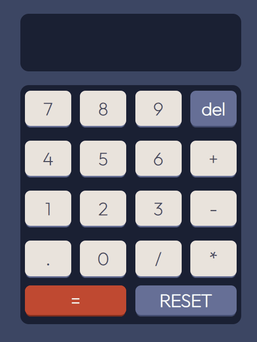

<h1 align="center">Calculadora</h1>

<h2>Tabela de Conteúdos</h2>
<ul>
    <li><a href="#visaoGeral">Visão geral</a>
    </li>
    <li><a href="#sobre">Sobre o projeto</a></li>
    <li><a href="#construidoCom">Construído com</a></li>
    <li><a href="#comoUtilizar">Como utilizar
</a></li>
</ul>

<h2 align="center" id="visaoGeral">Visão geral</h2>
<div align="center">

</div>
<h2 id="sobre" align="center">Sobre o projeto</h2>
<p>Essa calculadora foi construída utilizando componentes de classe reutilizáveis e states React. </p>

<h2 id="construidoCom" align="center">Construído com</h2>
<ul>
    <li>React</li>
    <li>Class Component</li>
    <li>Css</li>
    <li>Media Queries</li>
</ul>

<h2 id="comoUtilizar" align="center">Como utilizar</h2>
<p>Você pode acessar essa aplicação através desse <a href="https://calculator-wreact.netlify.app/">link</a> ou rodar através do seu computador da seguinte forma: </p>
<br>

Para clonar e rodar essa aplicação você precisará do [Git](https://git-scm.com) e do [Node.js](https://nodejs.org/en/download/) (que vem com o [npm](http://npmjs.com)) instalado no seu computador. No terminal de comando:

```bash
# Clone esse repositório
$ git clone https://github.com/Elivelton132900/calculadora-react

# Install dependencies
$ npm install

# Run the app
$ npm start
```
